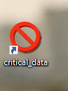
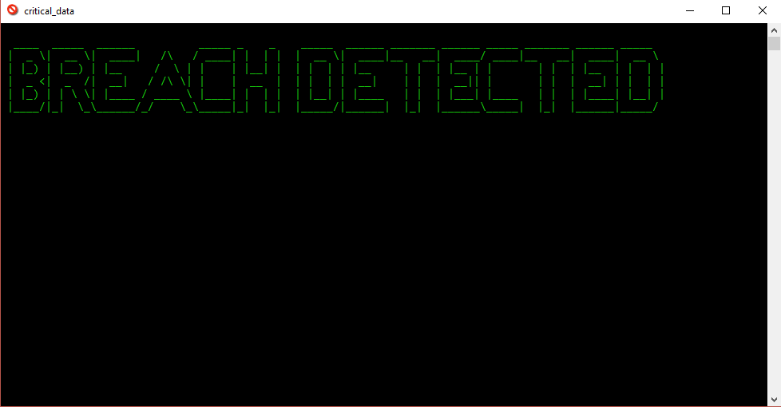

# Alarm
  This program can be used for fun to prank your friends. You can create shortcut on desktop of this program and rename label to make it     appealing so that peoples couldn't resist to click on it.When user click the icon this program open a terminal with some ascii art and alarm. This alarm do not stop even if you close the terminal you have to kill `cmd.exe` manually using task manager or using kill command.

## icon

## UI

